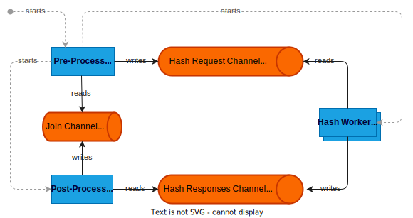

[](https://goreportcard.com/report/github.com/aicirt2012/fileintegrity)
[](https://www.gnu.org/licenses/gpl-3.0)

# File Integrity (FI)
File Integrity is a performant and simple to use tool that verifies the integrity of all files contained within a directory. Comparable to the well-known version control system [git](https://git-scm.com/), it creates a hidden folder on root level where all the file hashes are stored and managed transparently for the user.

### Key Features:
- **Manage file integrity:** Manages the creation, modification and deletion of file hashes within an integrity file for an entire directory.
- **Verify file integrity:** File verification based on the integrity file for an entire directory.
- **Duplicate check:** Fast file duplicate check based on stored hashes within the integrity file.
- **Contained check:** Fast check if files of an external directory are contained within the integrity file.
- **Style check:** Linter-like feedback regarding the file and directory structure based on the integrity file.

### Key Design Principles:
- **Fast execution:** Highly multithreaded to reduce execution times optimized for SDDs and HDDs as well.
- **Flexible usage:** CLI to support simple use cases and a go-module to support integrated more complex use cases.
- **Resilient architecture:** Partial update strategy allows to re-enter aborted executions without much time loss, which is important for large directories.
- **Multi-platform support:**  Support for Linux, macOS and Windows.
- **Keep it simple, stupid:**  A pragmatic implementation approach with pure go-lang.


## Cli Usage
Download the binary for your platform from the latest release and set path variable accordingly.

Create or update integrity file for directory:
```bash
$ fileintegrity upsert <dir>
```

Verify existing files in a directory with integrity file:
```bash
$ fileintegrity verify <dir>
```

The following commands provide tooling besides the primary integrity functionality. Checks for duplicate files within the integrity file:
```bash
$ fileintegrity check duplicates <dir>
```

Checks if files of an external directory are contained within the integrity file. With the optional flag fix, contained and duplicated files are deleted form the external directory:
```bash
$ fileintegrity check contains <dir> <externalDir> [--fix]
```
_Note:_ Files are compared based on a computed SHA-256 hash. In theory, there might be collisions. However, in practice skipping the byte-by-byte comparison ia a huge performance advantage.

Checks style issues related to the file system based on the integrity file. Check categories are: Directory hierarchy issues, path and directory length issues, naming issues.
```bash
$ fileintegrity check style <dir>
```

Checks the file extension distribution statistics based on the integrity file.
```bash
$ fileintegrity check ext-stats <dir>
```

### Example Scenario
Assume the directory `~/images` contains the following structure on the file system:
```
├─ 2020 Yellowstone National Park
│  ├─ IMG_0091.jpg
│  └─ IMG_0235.jpg
└─ 2021 Las Vegas
   ├─ DSC_0203.jpg
   └─ DSC_0255.jpg
```
**Step 1: Initialize the file integrity**

On a not initialized directory, the `upsert` command adds a hidden folder named `.integrity` in the root directory. Within that folder a file named `.integrity` is created, that contains the actual file integrity information. For traceability reasons, a log file is created as well by default.

Command:
```bash
$ fileintegrity upsert ~/images
```
Console output:

```bash
231210.051712  NEW  images/2020 Yellowstone National Park/IMG_0091.jpg
231210.051712  NEW  images/2020 Yellowstone National Park/IMG_0235.jpg
231210.051712  NEW  images/2021 Las Vegas/DSC_0203.jpg
231210.051712  NEW  images/2021 Las Vegas/DSC_0255.jpg

//// Upsert Summary //////////////////////
Execution time:                     0.03 s
Total size:                          39 MB
Hash rate:                        1.3 GB/s
Skipped files:                           0
New files:                               4
Updated files:                           0
Deleted files:                           0
```

File system result:
```
├─ .integrity                       // added
│  ├─ .integrity                    // added
│  └─ 231113.201500 upsert.log      // added
├─ 2020 Yellowstone National Park   // unchanged
└─ 2021 Las Vegas                   // unchanged
```
**Step 2: Update file integrity**

Assume the image `IMG_0091.jpg` was edited, saved and has now a newer modification date as before. The same `upsert` command as before is executed to update the file integrity information. The integrity file is adapted and additional log file is created.

Command:

```bash
$ fileintegrity upsert ~/images
```

Console output:
```bash
231210.051712  UPDATE  images/2020 Yellowstone National Park/IMG_0091.jpg

//// Upsert Summary //////////////////////
Execution time:                     0.02 s
Total size:                          39 MB
Hash rate:                        235 MB/s
Skipped files:                           3
New files:                               0
Updated files:                           1
Deleted files:                           0
```

File system result:
```
├─ .integrity                       // modified
│  ├─ .integrity                    // modified
│  ├─ 221113.201500 upsert.log      // unchanged
│  └─ 221201.130100 upsert.log      // added
├─ 2020 Yellowstone National Park   // modified
│  ├─ IMG_0091.jpg                  // modified
│  └─ IMG_0235.jpg                  // unchanged
└─ 2021 Las Vegas                   // unchanged
   ├─ DSC_0203.jpg                  // unchanged
   └─ DSC_0255.jpg                  // unchanged
```
**Step 3: Verify file integrity**

With the `verify` command, files existing on the file system are verified with integrity file information. Invalid files can be distinguished into: file does not exist, file size different, and file hash different.

Command:
```bash
$ fileintegrity verify ~/images
```

Console output:
```bash
231210.051712  OK  images/2020 Yellowstone National Park/IMG_0091.jpg  
231210.051713  OK  images/2020 Yellowstone National Park/IMG_0235.jpg   
231210.051713  OK  images/2021 Las Vegas/DSC_0203.jpg  
231210.051713  OK  images/2021 Las Vegas/DSC_0255.jpg  

//// Verify Summary //////////////////////
Execution time:                     0.03 s
Total size:                          39 MB
Hash rate:                        1.3 GB/s
Verified valid files:                    4
Verified invalid files:                  0
Percentage of invalid files:      0.000000
```

File system result:
```
├─ .integrity                       // modified
│  ├─ .integrity                    // unchanged
│  ├─ 221113.201500 upsert.log      // unchanged
│  ├─ 221201.130100 upsert.log      // unchanged
│  └─ 230101.100513 verify.log      // added
├─ 2020 Yellowstone National Park   // unchanged
└─ 2021 Las Vegas                   // unchanged
```


## Go-Module Usage
For integration purpose, the go module offers a simple but powerful interface. Use the following command to download the repository to your local file system:
```bash
$ go get github.com/aicirt2012/fileintegrity
```

Sample usage:
```go
package main

import "github.com/aicirt2012/fileintegrity"

func main(args []string) {
   options := fileintegrity.Options{ 
        LogConsole:  true,
		LogFile:     true,
		Backup:      false,
		Progressbar: true,
	}
   fileintegrity.Upsert(args[0], options)
   fileintegrity.Verify(args[0], options)
}
```


## Internal Architecture
In a first pre-processing step, the directory is traversed into a flat list of files sequentially, that must be processed. In a second step, the time-consuming file hashing is performed in parallel. Therefore, the post-processing go routine is started. Depending on the number of CPUs many hash-worker routines are started as well. The pre-processing routine produces hash requests for files and writes these into a buffered channel until the channel reaches the maximum buffer size or all files processed. In the meanwhile, the hash worker consumes the hash requests. The file content is read and hashed from the file system. Afterwards, the file hash is written into a buffered hash response channel. The post-processing routing reads from the hash response channel sequentially and updates or inserts the integrity file with the new hash. When the file hash post-processing is finished, the sync channel is closed to signal termination.

Within the second step, there are three types of file system access: Reading the actual file content, updating the integrity file, and append the log file. File system access is a performance critical operation, especially, when it’s required for each file. On the other hand, persisting the result on the file system prevents long reprocessing times when an execution is aborted for what ever reason. Therefore, performance and resilience must be balanced carefully. Buffering the log and integrity file updates based on the hashed content size reduces the file system access in practice significantly by many factors. Furthermore, in step two are only file append operations are performed to reduce file system io. For the integrity file this means a post-processing is required considering that an update or delete operation can only append. In a final third step, the integrity file is 'defragmented', means duplicate entries are removed based on the internal creation time stamp.




## Development

Run CLI:
```bash
$ go run src/cli/main.go -- upsert <dir>
```

Run Tests:
```bash
$ go test ./...         # All tests
$ go test ./src/...     # Unit tests
$ go test ./tests/...   # Integration tests
```

Build:
```bash
$ go build -o fileintegrity ./src/cli/main.go  
```
